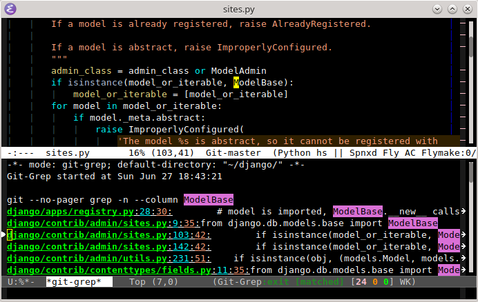
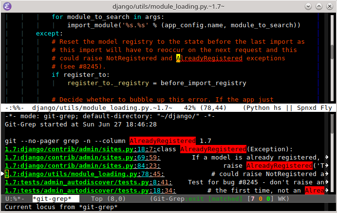

git-grep.el
===========

`git-grep.el` is a binding of `git-grep` command into emacs.

* Invoke with `git-grep` command

  

* And run

  

* Or choose an old revision

  

* And view at it was in that old revision

  
