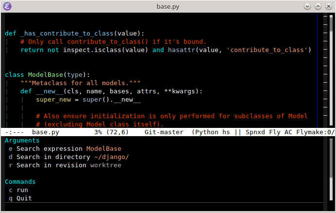
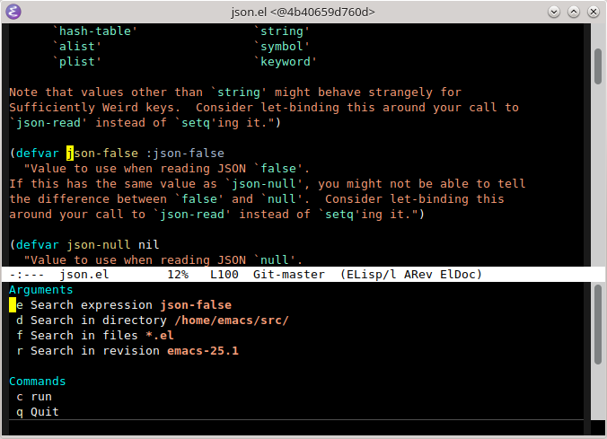
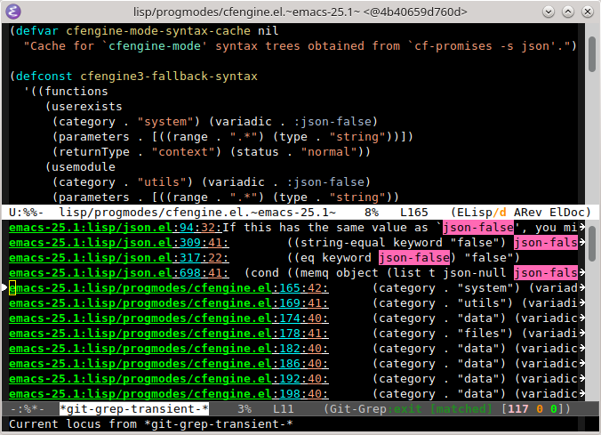

git-grep-transient.el
=====================

Search pattern in project using [`git-grep`](https://git-scm.com/docs/git-grep).

* Invoke with `M-x git-grep-transient` command

  

* You can choose an old revision

  

* Press Enter to open the file at the chosen revision

  
